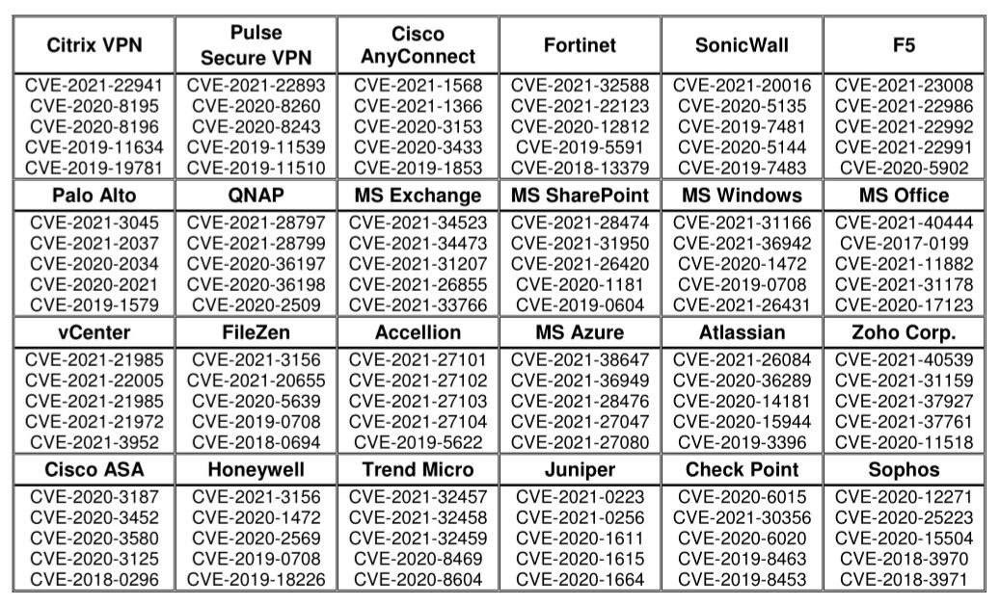

# 主流供应商的一些攻击性漏洞汇总

网络安全专家 [@Alexander Knorr](https://about.me/opexxx) 在推特上分享的一些有关于供应商的一些 CVE 严重漏洞，[详情](https://twitter.com/opexxx/status/1456765611636363267)，仅列出了 CVE 编号，无相关漏洞详情。所以在分享的图片基础上进行新增了漏洞 Title，官方公告，漏洞分析，利用代码，概念证明以及新增或删减了多个CVE等，另外修正了部分 CVE 编号的错误。

红队中易被攻击的一些重点系统漏洞整理详见：https://forum.ywhack.com/bountytips.php?Vulnerability

- [主流供应商的一些攻击性漏洞汇总 TOC](#主流供应商的一些攻击性漏洞汇总)
  - [Citrix VPN](#citrix-vpn)
  - [Pulse Secure VPN](#pulse-secure-vpn)
  - [Cisco AnyConnect](#cisco-anyconnect)
  - [Fortinet](#fortinet)
  - [SonicWall](#sonicwall)
  - [F5](#f5)
  - [Palo Alto](#palo-alto)
  - [QNAP](#qnap)
  - [MS Exchange](#ms-exchange)
  - [MS SharePoint](#ms-sharepoint)
  - [MS Windows](#ms-windows)
  - [MS Office](#ms-office)
  - [VMware](#vmware)
  - [FileZen](#filezen)
  - [MS Azure](#ms-azure)
  - [Atlassian](#atlassian)
  - [Zoho(卓豪) Corp.](#zoho卓豪-corp)
  - [Cisco ASA](#cisco-asa)
  - [Juniper（瞻博网络）](#juniper（瞻博网络）)

## Citrix VPN

**CVE-2021-22941 Citrix ShareFile 存储区控制器中的 RCE**

* [官方公告](https://support.citrix.com/article/CTX328123)
* [漏洞分析](https://codewhitesec.blogspot.com/2021/09/citrix-sharefile-rce-cve-2021-22941.html)
* [利用代码](https://github.com/hoavt184/CVE-2021-22941)

**CVE-2020-8195 Citrix 未授权访问漏洞**

* [官方公告](https://support.citrix.com/article/CTX276688)
* [利用代码](https://packetstormsecurity.com/files/160047/Citrix-ADC-NetScaler-Local-File-Inclusion.html)

**CVE-2020-8196 Citrix Nitro API 未授权访问漏洞**

* [官方公告](https://support.citrix.com/article/CTX276688)
* [漏洞分析](https://www.hacking8.com/bug-product/Citrix/CVE-2020-8196-Citrix-Nitro-API-%25E6%259C%25AA%25E6%258E%2588%25E6%259D%2583%25E8%25AE%25BF%25E9%2597%25AE%25E6%25BC%258F%25E6%25B4%259E.html)
* [利用代码](https://packetstormsecurity.com/files/160047/Citrix-ADC-NetScaler-Local-File-Inclusion.html)

**CVE-2019-11634 Citrix Workspace/Receiver 远程代码执行漏洞**

* [官方公告](https://support.citrix.com/article/CTX251986)
* [漏洞细节](https://web.archive.org/web/20190908231042/https://www.nccgroup.trust/uk/our-research/technical-advisory-citrix-workspace-receiver-remote-code-execution-vulnerability/)

**CVE-2019-19781 Citrix 远程代码执行漏洞**

* [官方公告](https://support.citrix.com/article/CTX267027)
* [利用代码](https://github.com/projectzeroindia/CVE-2019-19781)

## Pulse Secure VPN

**CVE-2021-22893 Pulse Connect Secure 任意代码执行**

* [官方公告](https://kb.pulsesecure.net/articles/Pulse_Security_Advisories/SA44784/)
* [漏洞细节](https://www.mandiant.com/resources/suspected-apt-actors-leverage-bypass-techniques-pulse-secure-zero-day)
* [漏洞细节](https://zh-cn.tenable.com/blog/cve-2021-22893-zero-day-vulnerability-in-pulse-connect-secure-exploited-in-the-wild)

**CVE-2020-8260 Pulse Connect Secure Gzip 提取导致远程代码执行**

* [官方公告](https://kb.pulsesecure.net/articles/Pulse_Security_Advisories/SA44601)
* [漏洞细节](https://research.nccgroup.com/2020/10/26/technical-advisory-pulse-connect-secure-rce-via-uncontrolled-gzip-extraction-cve-2020-8260/)
* [利用代码](https://packetstormsecurity.com/files/160619/Pulse-Secure-VPN-Remote-Code-Execution.html)

**CVE-2020-8243 Pulse Connect Secure 通过模板注入的 RCE**

* [官方公告](https://kb.pulsesecure.net/articles/Pulse_Security_Advisories/SA44588)
* [漏洞细节](https://research.nccgroup.com/2020/10/06/technical-advisory-pulse-connect-secure-rce-via-template-injection-cve-2020-8243/)
* [概念证明](https://research.nccgroup.com/2020/10/06/technical-advisory-pulse-connect-secure-rce-via-template-injection-cve-2020-8243/)

**CVE-2019-11539 Pulse Secure 命令注入**

* [官方公告](https://kb.pulsesecure.net/articles/Pulse_Security_Advisories/SA44101)
* [漏洞细节](https://devco.re/blog/2019/09/02/attacking-ssl-vpn-part-3-the-golden-Pulse-Secure-ssl-vpn-rce-chain-with-Twitter-as-case-study/)
* [利用代码](https://packetstormsecurity.com/files/155277/Pulse-Secure-VPN-Arbitrary-Command-Execution.html)

**CVE-2019-11510 Pulse Secure SSL VPN 任意文件读取**

* [官方公告](https://kb.pulsesecure.net/articles/Pulse_Security_Advisories/SA44101/)
* [利用代码](https://packetstormsecurity.com/files/154176/Pulse-Secure-SSL-VPN-8.1R15.1-8.2-8.3-9.0-Arbitrary-File-Disclosure.html)

## Cisco AnyConnect

**CVE-2021-1568 Windows Cisco AnyConnect 拒绝服务攻击**

* [官方公告](https://tools.cisco.com/security/center/content/CiscoSecurityAdvisory/cisco-sa-anyconnect-dos-hMhyDfb8)

**CVE-2021-1366 Windows Cisco AnyConnect DLL劫持漏洞**

* [官方公告](https://tools.cisco.com/security/center/content/CiscoSecurityAdvisory/cisco-sa-anyconnect-dll-hijac-JrcTOQMC)
* [技术分析](https://www.coresecurity.com/core-labs/articles/analysis-cisco-anyconnect-posture-hostscan-local-privilege-escalation-cve-2021)

**CVE-2020-3153 Cisco AnyConnect < 4.8.02042 权限提升漏洞**

* [官方公告](https://tools.cisco.com/security/center/content/CiscoSecurityAdvisory/cisco-sa-ac-win-path-traverse-qO4HWBsj)
* [利用代码](https://packetstormsecurity.com/files/159420/Cisco-AnyConnect-Privilege-Escalation.html)

**CVE-2020-3433 Cisco AnyConnect 权限提升漏洞**

* [官方公告](https://tools.cisco.com/security/center/content/CiscoSecurityAdvisory/cisco-sa-anyconnect-dll-F26WwJW)
* [利用代码](https://packetstormsecurity.com/files/159420/Cisco-AnyConnect-Privilege-Escalation.html)

**CVE-2019-1853**

* [官方公告](https://tools.cisco.com/security/center/content/CiscoSecurityAdvisory/cisco-sa-20190515-anyconnectclient-oob-read)

## Fortinet

**CVE-2021-32588 FortiPortal 远程代码执行漏洞**

* [官方公告](https://fortiguard.com/advisory/FG-IR-21-077)
* [漏洞细节](https://www.ddosi.org/cve-2021-32588/)
* [利用代码](https://www.ddosi.org/cve-2021-32588/)

**CVE-2021-22123 Fortinet FortiWeb 命令注入**

* [官方公告](https://fortiguard.com/advisory/FG-IR-20-120)
* [漏洞细节](https://github.com/murataydemir/CVE-2021-22123)
* [概念证明](https://github.com/murataydemir/CVE-2021-22123)

**CVE-2020-12812 FortiOS SSL VPN 不正确的身份验证**

* [官方公告](https://www.fortiguard.com/psirt/FG-IR-19-283)
* [漏洞细节](https://zh-cn.tenable.com/blog/cve-2018-13379-cve-2019-5591-cve-2020-12812-fortinet-vulnerabilities-targeted-by-apt-actors)

**CVE-2019-5591 FortiOS 默认配置漏洞**

* [官方公告](https://www.fortiguard.com/psirt/FG-IR-19-037)
* [漏洞细节](https://zh-cn.tenable.com/blog/cve-2018-13379-cve-2019-5591-cve-2020-12812-fortinet-vulnerabilities-targeted-by-apt-actors)

**CVE-2018-13379 FortiGate SSL VPN 中的路径遍历漏洞**

* [官方公告](https://fortiguard.com/advisory/FG-IR-18-384)
* [漏洞细节](https://zh-cn.tenable.com/blog/cve-2018-13379-cve-2019-11510-fortigate-and-pulse-connect-secure-vulnerabilities-exploited-in)
* [利用代码](https://github.com/milo2012/CVE-2018-13379)

## SonicWall

**CVE-2021-20016 SonicWall SSLVPN SMA100 SQL注入漏洞**

* [官方公告](https://psirt.global.sonicwall.com/vuln-detail/SNWLID-2021-0001)
* [漏洞细节](https://zh-cn.tenable.com/blog/cve-2021-20016-zero-day-vulnerability-in-sonicwall-secure-mobile-access-sma-exploited)

**CVE-2020-5135 SonicWall VPN OS缓冲区溢出漏洞**

* [官方公告](https://psirt.global.sonicwall.com/vuln-detail/SNWLID-2020-0010)
* [漏洞细节](https://isc.sans.edu/diary/rss/26692)

**CVE-2020-5144 SonicWall Global VPN 权限提升**

* [官方公告](https://psirt.global.sonicwall.com/vuln-detail/SNWLID-2020-0020)
* [漏洞细节](https://cymptom.com/cve-2020-5144-sonicwall-global-vpn-new-elevation-of-privileges-vulnerability/2021/01/)
* [概念证明](https://cymptom.com/cve-2020-5144-sonicwall-global-vpn-new-elevation-of-privileges-vulnerability/2021/01/)

**CVE-2019-7481 SONICWALL SMA100 预认证 SQL 注入**

* [官方公告](https://psirt.global.sonicwall.com/vuln-detail/SNWLID-2019-0016)
* [概念证明](https://github.com/b4bay/CVE-2019-7482)

**CVE-2019-7483 SonicWall SMA100 目录遍历**

* [官方公告](https://psirt.global.sonicwall.com/vuln-detail/SNWLID-2019-0018)
* [漏洞细节](https://blog.scrt.ch/2020/02/11/sonicwall-sra-and-sma-vulnerabilties/)

## F5

**CVE-2021-23008 BIG-IP KDC 欺骗漏洞**

* [官方公告](https://support.f5.com/csp/article/K51213246)
* [漏洞细节](https://www.silverfort.com/blog/silverfort-researchers-discover-kdc-spoofing-vulnerability-in-f5-big-ip-cve-2021-23008/)

**CVE-2021-22986 F5 BIG-IP iControl REST 未授权 RCE**

* [官方公告](https://support.f5.com/csp/article/K03009991)
* [漏洞细节](https://attackerkb.com/topics/J6pWeg5saG/k03009991-icontrol-rest-unauthenticated-remote-command-execution-vulnerability-cve-2021-22986)
* [利用代码](https://github.com/Al1ex/CVE-2021-22986)

**CVE-2021-22992 F5 BIG-IP 缓冲区溢出漏洞**

* [官方公告](https://support.f5.com/csp/article/K52510511)

**CVE-2021-22991 BIG-IP 缓冲区溢出漏洞**

* [官方公告](https://support.f5.com/csp/article/K56715231)
* [概念验证](https://github.com/EdgeSecurityTeam/Vulnerability/blob/main/BIG-IP%2520%25E7%25BC%2593%25E5%2586%25B2%25E5%258C%25BA%25E6%25BA%25A2%25E5%2587%25BA%25E6%25BC%258F%25E6%25B4%259E%2520(CVE-2021-22991).md)

**CVE-2020-5902 BIG-IP TMUI 远程代码执行漏洞**

* [官方公告](https://support.f5.com/csp/article/K52145254)
* [漏洞细节](https://xz.aliyun.com/t/8008)
* [利用代码](https://github.com/jas502n/CVE-2020-5902/)

## Palo Alto

**CVE-2021-3045 PAN-OS web界面的OS命令参数注入漏洞**

* [官方公告](https://security.paloaltonetworks.com/CVE-2021-3045)

**CVE-2021-2037 未知**

暂无详情

**CVE-2020-2034 PAN-OS GlobalProtect 操作系统命令注入漏洞**

* [官方公告](https://security.paloaltonetworks.com/CVE-2020-2034)
* [概念验证](https://github.com/noperator/panos-scanner)

**CVE-2020-2021 PAN-OS SAML 身份验证绕过**

* [官方公告](https://security.paloaltonetworks.com/CVE-2020-2021)
* [漏洞细节](https://www.randori.com/blog/cve-2020-2021-pan-os-advisory-poc/)

**CVE-2019-1579 PAN-OS GlobalProtect 门户和网关接口远程代码执行**

* [官方公告](https://security.paloaltonetworks.com/CVE-2019-1579)
* [漏洞细节](https://devco.re/blog/2019/07/17/attacking-ssl-vpn-part-1-PreAuth-RCE-on-Palo-Alto-GlobalProtect-with-Uber-as-case-study/)
* [概念验证](https://devco.re/blog/2019/07/17/attacking-ssl-vpn-part-1-PreAuth-RCE-on-Palo-Alto-GlobalProtect-with-Uber-as-case-study/)

## QNAP

**CVE-2021-28797 QNAP QTS Surveillance Station插件远程代码执行漏洞**

* [官方公告](https://www.qnap.com/en/security-advisory/qsa-21-07)
* [漏洞细节](https://ssd-disclosure.com/ssd-advisory-qnap-pre-auth-cgi_find_parameter-rce/)
* [利用代码](https://github.com/EdgeSecurityTeam/Vulnerability/blob/main/QNAP%2520QTS%2520Surveillance%2520Station%25E6%258F%2592%25E4%25BB%25B6%25E8%25BF%259C%25E7%25A8%258B%25E4%25BB%25A3%25E7%25A0%2581%25E6%2589%25A7%25E8%25A1%258C%25E6%25BC%258F%25E6%25B4%259E%25EF%25BC%2588CVE-2021-28797%25EF%25BC%2589.md)

**CVE-2021-28799 qnap hybrid_backup_sync 授权机制不正确**

* [官方公告](https://www.qnap.com/en/security-advisory/QSA-21-13)
* [漏洞细节](https://unit42.paloaltonetworks.com/ech0raix-ransomware-soho/)

**CVE-2020-36197 qnap music_station 对路径名的限制不恰当（路径遍历）**

* [官方公告](https://www.qnap.com/zh-tw/security-advisory/qsa-21-08)
* [利用代码](https://packetstormsecurity.com/files/162849/QNAP-MusicStation-MalwareRemover-File-Upload-Command-Injection.html)

**CVE-2021-36198 qnap malware_remover 命令注入**

* [官方公告](https://www.qnap.com/en/security-advisory/QSA-21-16)
* [利用代码](https://packetstormsecurity.com/files/162849/QNAP-MusicStation-MalwareRemover-File-Upload-Command-Injection.html)

**CVE-2020-2509 QNAP QTS 和 QuTS hero 中的命令注入漏洞**

* [官方公告](https://www.qnap.com/en/security-advisory/qsa-21-05)
* [漏洞细节](https://attackerkb.com/topics/blXTLRqfIu/cve-2020-2509)

## MS Exchange

**CVE-2021-34523 Microsoft Exchange Server 提权漏洞**

* [官方公告](https://msrc.microsoft.com/update-guide/vulnerability/CVE-2021-34523)
* [漏洞细节](https://www.4hou.com/posts/MNMR)
* [漏洞分析](https://hosch3n.github.io/2021/08/24/ProxyShell%25E6%25BC%258F%25E6%25B4%259E%25E5%2588%2586%25E6%259E%2590/#CVE-2021-34523)
* [利用代码](https://github.com/hosch3n/ProxyVulns)

**CVE-2021-34473 Microsoft Exchange Server 远程代码执行漏洞**

* [官方公告](https://msrc.microsoft.com/update-guide/vulnerability/CVE-2021-34473)
* [漏洞细节](https://www.4hou.com/posts/L0Lj)
* [概念验证](https://github.com/cyberheartmi9/Proxyshell-Scanner)

**CVE-2021-31207 Microsoft Exchange Server 安全功能绕过漏洞**

* [官方公告](https://msrc.microsoft.com/update-guide/vulnerability/CVE-2021-31207)
* [利用代码](https://packetstormsecurity.com/files/163895/Microsoft-Exchange-ProxyShell-Remote-Code-Execution.html)

**CVE-2021-26855 Microsoft Exchange Server 远程代码执行漏洞**

* [官方公告](https://msrc.microsoft.com/update-guide/vulnerability/CVE-2021-26855)
* [概念验证](https://github.com/projectdiscovery/nuclei-templates/blob/master/cves/2021/CVE-2021-26855.yaml)
* [利用代码](https://packetstormsecurity.com/files/161938/Microsoft-Exchange-ProxyLogon-Remote-Code-Execution.html)

**CVE-2021-33766 Microsoft Exchange 信息泄露漏洞**

* [官方公告](https://msrc.microsoft.com/update-guide/vulnerability/CVE-2021-33766)
* [漏洞细节](https://www.4hou.com/posts/E1Nl)
* [漏洞分析](https://www.zerodayinitiative.com/blog/2021/8/30/proxytoken-an-authentication-bypass-in-microsoft-exchange-server)
* [概念验证](https://github.com/bhdresh/CVE-2021-33766)

## MS SharePoint

**CVE-2021-28474 Microsoft SharePoint Server 远程代码执行漏洞**

* [官方公告](https://msrc.microsoft.com/update-guide/en-US/vulnerability/CVE-2021-28474)
* [漏洞分析](https://www.zerodayinitiative.com/blog/2021/7/7/cve-2021-28474-sharepoint-remote-code-execution-via-server-side-control-interpretation-conflict) [英文]
* [漏洞分析](https://zhuanlan.zhihu.com/p/388215518) [中文]

**CVE-2021-31950 Microsoft SharePoint Server 欺骗漏洞**

* [官方公告](https://msrc.microsoft.com/update-guide/en-US/vulnerability/CVE-2021-31950)
* [漏洞利用](https://packetstormsecurity.com/files/163080/Microsoft-SharePoint-Server-16.0.10372.20060-Server-Side-Request-Forgery.html)

**CVE-2021-26420 Microsoft SharePoint Server 远程代码执行漏洞**

* [官方公告](https://msrc.microsoft.com/update-guide/en-US/vulnerability/CVE-2021-26420)
* [漏洞分析](https://www.zerodayinitiative.com/blog/2021/10/5/cve-2021-26420-remote-code-execution-in-sharepoint-via-workflow-compilation)

**CVE-2020-1181 Microsoft SharePoint Server 远程代码执行漏洞**

* [官方公告](https://msrc.microsoft.com/update-guide/vulnerability/CVE-2020-1181)
* [漏洞分析](https://www.zerodayinitiative.com/blog/2020/6/16/cve-2020-1181-sharepoint-remote-code-execution-through-web-parts)
* [概念证明](https://borncity.com/win/2020/06/21/sharepoint-poc-fr-rce-schwachstelle-cve-2020-1181/)

**CVE-2019-0604 Microsoft SharePoint 远程代码执行漏洞**

* [官方公告](https://msrc.microsoft.com/update-guide/zh-tw/vulnerability/CVE-2019-0604)
* [漏洞分析](https://zh-cn.tenable.com/blog/cve-2019-0604-critical-microsoft-sharepoint-remote-code-execution-flaw-actively-exploited)
* [利用代码](https://github.com/k8gege/CVE-2019-0604)

## MS Windows

**CVE-2021-31166 HTTP协议栈远程代码执行漏洞**

* [官方公告](https://msrc.microsoft.com/update-guide/vulnerability/CVE-2021-31166)
* [漏洞细节](https://www.trustwave.com/en-us/resources/blogs/spiderlabs-blog/cve-2021-31166-rce-in-microsoft-httpsys/)
* [利用代码](https://github.com/0vercl0k/CVE-2021-31166)

**CVE-2021-36942 Microsoft Windows LSA欺骗漏洞**

* [官方公告](https://msrc.microsoft.com/update-guide/vulnerability/CVE-2021-36942)
* [漏洞细节](https://www.kb.cert.org/vuls/id/405600)

**CVE-2021-26431 Microsoft Windows_10 特权管理不恰当**

* [官方公告](https://msrc.microsoft.com/update-guide/en-US/vulnerability/CVE-2021-26431)
* [漏洞细节](https://attackerkb.com/topics/y2dcz3KMU1/cve-2021-26431)

**CVE-2020-1472 Windows domain controller 远程代码执行漏洞 Netlogon**

* [官方公告](https://msrc.microsoft.com/update-guide/en-US/vulnerability/CVE-2020-1472)
* [漏洞分析](https://xz.aliyun.com/t/8367) [中文]
* [漏洞分析](https://awakesecurity.com/blog/network-threat-hunting-for-zerologon-exploits-cve-2020-1472/) [英文]
* [利用代码](https://github.com/SecuraBV/CVE-2020-1472)

**CVE-2019-0708 远程桌面服务远程代码执行漏洞**

* [官方公告](https://msrc.microsoft.com/update-guide/vulnerability/CVE-2019-0708)
* [漏洞分析](https://www.cnblogs.com/backlion/p/11482322.html)
* [概念验证](https://github.com/zerosum0x0/CVE-2019-0708)
* [利用代码](https://github.com/algo7/bluekeep_CVE-2019-0708_poc_to_exploit)

## MS Office

**CVE-2021-40444 Microsoft MSHTML 远程代码执行漏洞**

* [官方公告](https://msrc.microsoft.com/update-guide/vulnerability/CVE-2021-40444)
* [漏洞分析](https://paper.seebug.org/1718/)
* [利用代码](https://github.com/klezVirus/CVE-2021-40444)

**CVE-2017-11882 Microsoft Office 内存损坏漏洞**

* [官方公告](https://msrc.microsoft.com/update-guide/en-us/vulnerability/CVE-2017-11882)
* [漏洞分析](https://web.archive.org/web/20181104111128/https://embedi.com/blog/skeleton-closet-ms-office-vulnerability-you-didnt-know-about/)
* [利用代码](https://github.com/0x09AL/CVE-2017-11882-metasploit)

**CVE-2021-31178 Microsoft Office 信息泄露漏洞**

* [官方公告](https://msrc.microsoft.com/update-guide/vulnerability/CVE-2021-31178)

**CVE-2020-17123 Microsoft Excel 远程代码执行漏洞**

* [官方公告](https://msrc.microsoft.com/update-guide/vulnerability/CVE-2020-17123)
* [漏洞细节](https://talosintelligence.com/vulnerability_reports/TALOS-2020-1153)

**CVE-2017-0199 Microsoft Office Word OLE对象代码执行漏洞**

* [官方公告](https://msrc.microsoft.com/update-guide/vulnerability/CVE-2017-0199)
* [漏洞分析](https://www.anquanke.com/post/id/85873)
* [利用代码](https://github.com/bhdresh/CVE-2017-0199)

## VMware

**CVE-2021-21985 VMware vCenter Server远程代码执行漏洞**

* [官方公告](https://www.vmware.com/security/advisories/VMSA-2021-0010.html)
* [漏洞分析](http://noahblog.360.cn/vcenter-cve-2021-2021-21985/)
* [利用代码](https://github.com/r0ckysec/CVE-2021-21985)

**CVE-2021-22005 VMware vCenter Analytics 任意文件上传漏洞**

* [官方公告](https://kb.vmware.com/s/article/85717)
* [漏洞分析](https://cloud.tencent.com/developer/article/1887641)
* [利用代码](https://github.com/r0ckysec/CVE-2021-22005)

**CVE-2021-21972 VMware vCenter Server 远程代码执行漏洞**

* [官方公告](https://www.vmware.com/security/advisories/VMSA-2021-0002.html)
* [漏洞分析](https://cert.360.cn/report/detail?id=62aac9b181bcfcb2b5faf33c6907a3dc)
* [利用代码](https://github.com/NS-Sp4ce/CVE-2021-21972)

**CVE-2021-3952 VMware vCenter 敏感信息泄露漏洞**

* [官方公告](https://www.vmware.com/security/advisories/VMSA-2020-0006.html)
* [利用代码](https://github.com/guardicore/vmware_vcenter_cve_2020_3952)

**CVE-2021-21975 VMware vRealize Operations Manager API SSRF漏洞**

* [官方公告](https://www.vmware.com/security/advisories/VMSA-2021-0004.html)
* [概念验证](https://github.com/projectdiscovery/nuclei-templates/blob/master/cves/2021/CVE-2021-21975.yaml)

## FileZen

**CVE-2021-20655 FileZen os命令中使用的特殊元素转义处理不恰当（os命令注入）**

* [安全公告](https://jvn.jp/en/jp/JVN58774946/index.html)
* [漏洞细节](https://www.soliton.co.jp/support/2021/004334.html)

**CVE-2020-5639 FileZen 路径遍历**

* [安全公告](https://jvn.jp/en/jp/JVN12884935/index.html)
* [漏洞细节](https://www.soliton.co.jp/support/2020/004278.html)

**CVE-2018-0694**

* [安全公告](http://jvn.jp/en/jp/JVN95355683/index.html)
* [漏洞细节](https://www.soliton.co.jp/support/2018/003328.html)

## MS Azure

**CVE-2021-38647 Microsoft Azure Open Management Infrastructure 代码注入漏洞**

* [官方公告](https://msrc.microsoft.com/update-guide/vulnerability/CVE-2021-38647)
* [利用代码](https://github.com/horizon3ai/CVE-2021-38647)

**CVE-2021-36949 Microsoft Azure Active Directory Connect 身份验证绕过漏洞**

* [官方公告](https://msrc.microsoft.com/update-guide/vulnerability/CVE-2021-36949)
* [概念验证](https://github.com/Maxwitat/Check-AAD-Connect-for-CVE-2021-36949-vulnerability)

**CVE-2021-28476 Hyper-V 远程代码执行漏洞**

* [官方公告](https://msrc.microsoft.com/update-guide/vulnerability/CVE-2021-28476)
* [利用代码](https://github.com/0vercl0k/CVE-2021-28476)

**CVE-2021-27047 HEVC 视频扩展远程代码执行漏洞**

* [官方公告](https://msrc.microsoft.com/update-guide/vulnerability/CVE-2021-27047)

**CVE-2021-27080 Microsoft Azure Sphere mqueue inode 初始化内核代码执行漏洞**

* [官方公告](https://msrc.microsoft.com/update-guide/vulnerability/CVE-2021-27080)
* [漏洞细节](https://talosintelligence.com/vulnerability_reports/TALOS-2021-1250)

## Atlassian

**CVE-2021-26084 Confluence远程代码执行漏洞**

* [官方公告](https://jira.atlassian.com/browse/CONFSERVER-67940)
* [漏洞分析](http://www.hackdig.com/09/hack-483729.htm)
* [利用代码](https://packetstormsecurity.com/files/164013/Confluence-Server-7.12.4-OGNL-Injection-Remote-Code-Execution.html)

**CVE-2020-36289 Atlassian Jira Unauth 用户枚举**

* [官方公告](https://jira.atlassian.com/browse/JRASERVER-71559)
* [概念验证](https://github.com/projectdiscovery/nuclei-templates/blob/master/cves/2020/CVE-2020-36289.yaml)

**CVE-2020-14181 Atlassian JIRA 8.11.1 用户枚举**

* [官方公告](https://jira.atlassian.com/browse/JRASERVER-71560)
* [利用代码](http://packetstormsecurity.com/files/161730/Atlassian-JIRA-8.11.1-User-Enumeration.html)

**CVE-2020-15944 Atlassian Jira Gantt-Chart 跨站脚本漏洞**

* [官方公告](https://www.syss.de/fileadmin/dokumente/Publikationen/Advisories/SYSS-2020-030.txt)
* [利用代码](https://packetstormsecurity.com/files/158752/Gantt-Chart-For-Jira-5.5.4-Cross-Site-Scripting.html)

**CVE-2019-3396 Confluence 未授权 RCE**

* [官方公告](https://jira.atlassian.com/browse/CONFSERVER-57974)
* [利用代码](https://github.com/jas502n/CVE-2019-3396)

## Zoho(卓豪) Corp.

**CVE-2021-40539 身份验证绕过漏洞**

* [官方公告](https://www.manageengine.com/products/self-service-password/kb/how-to-fix-authentication-bypass-vulnerability-in-REST-API.html)
* [利用过程](https://www.synacktiv.com/publications/how-to-exploit-cve-2021-40539-on-manageengine-adselfservice-plus.html)

**CVE-2021-31159 Zoho ManageEngine ServiceDesk Plus 9.4 用户枚举**

* [官方公告](https://www.manageengine.com/products/service-desk-msp/readme.html#10519)
* [利用代码](https://packetstormsecurity.com/files/163192/Zoho-ManageEngine-ServiceDesk-Plus-9.4-User-Enumeration.html)

**CVE-2021-37927 Zoho ManageEngine ADManager Plus SSO 弱身份验证**

* [官方公告](https://www.manageengine.com/products/ad-manager/release-notes.html#7111)

**CVE-2021-37761 Zoho ManageEngine ADManager Plus 任意文件上传**

* [官方公告](https://www.manageengine.com/products/ad-manager/release-notes.html#7111)

**CVE-2020-11518 Zoho ManageEngine ADSelfService Plus 远程代码执行**

* [官方公告](https://pitstop.manageengine.com/portal/community/topic/adselfservice-plus-5815-released-with-an-important-security-fix)
* [漏洞细节](https://honoki.net/2020/08/10/cve-2020-11518-how-i-bruteforced-my-way-into-your-active-directory/)

## Cisco ASA

**CVE-2020-3187 Cisco ASA/FTD 任意文件删除漏洞**

* [官方公告](https://tools.cisco.com/security/center/content/CiscoSecurityAdvisory/cisco-sa-asaftd-path-JE3azWw43)
* [漏洞细节](https://hackerone.com/reports/960330)
* [利用代码](https://packetstormsecurity.com/files/158648/Cisco-Adaptive-Security-Appliance-Software-9.7-Arbitrary-File-Deletion.html)

**CVE-2020-3452 Cisco ASA/FTD AnyConnect 文件读取漏洞**

* [官方公告](https://tools.cisco.com/security/center/content/CiscoSecurityAdvisory/cisco-sa-asaftd-ro-path-KJuQhB86)
* [概念验证](https://github.com/EdgeSecurityTeam/Vulnerability/blob/main/CISCO%2520ASA%25E4%25BB%25BB%25E6%2584%258F%25E6%2596%2587%25E4%25BB%25B6%25E8%25AF%25BB%25E5%258F%2596%25E6%25BC%258F%25E6%25B4%259E%2520(CVE-2020-3452).md)

**CVE-2020-3580 Cisco (ASA) 和 (FTD) 跨站脚本漏洞**

* [官方公告](https://tools.cisco.com/security/center/content/CiscoSecurityAdvisory/cisco-sa-asaftd-xss-multiple-FCB3vPZe)
* [漏洞细节](https://zh-cn.tenable.com/blog/cve-2020-3580-proof-of-concept-published-for-cisco-asa-flaw-patched-in-october?tns_redirect=true)
* [概念验证](https://github.com/projectdiscovery/nuclei-templates/issues/1790)

**CVE-2020-3125 Cisco ASA_5505_firmware 认证机制不当漏洞**

* [官方公告](https://tools.cisco.com/security/center/content/CiscoSecurityAdvisory/cisco-asa-kerberos-bypass-96Gghe2sS)
* [漏洞细节](https://www.silverfort.com/blog/cisco-vulnerability-cve-2020-3125/)

**CVE-2018-0296 Cisco ASA file_list.json path 文件读取漏洞**

* [官方公告](https://tools.cisco.com/security/center/content/CiscoSecurityAdvisory/cisco-sa-20180606-asaftd)
* [利用代码](https://www.exploit-db.com/exploits/44956/)

## Juniper（瞻博网络）

**CVE-2021-0223 Juniper Networks Junos OS权限提升漏洞**

* [官方公告](https://kb.juniper.net/JSA11114)

**CVE-2021-0256 Juniper junos 特权管理不当**

* [官方公告](https://kb.juniper.net/JSA11175)

**CVE-2020-1611 	Juniper Networks Junos Space路径遍历漏洞**

* [官方公告](https://kb.juniper.net/JSA10993)
* [利用代码](https://github.com/Ibonok/CVE-2020-1611)

**CVE-2020-1615 Juniper junos 使用硬编码的凭证**

* [官方公告](https://kb.juniper.net/JSA10998)

**CVE-2020-1664 Junos OS 设备控制守护进程中的缓冲区溢出漏洞**

* [官方公告](https://kb.juniper.net/JSA11061%09Vendor%20Advisory%20%0A)
